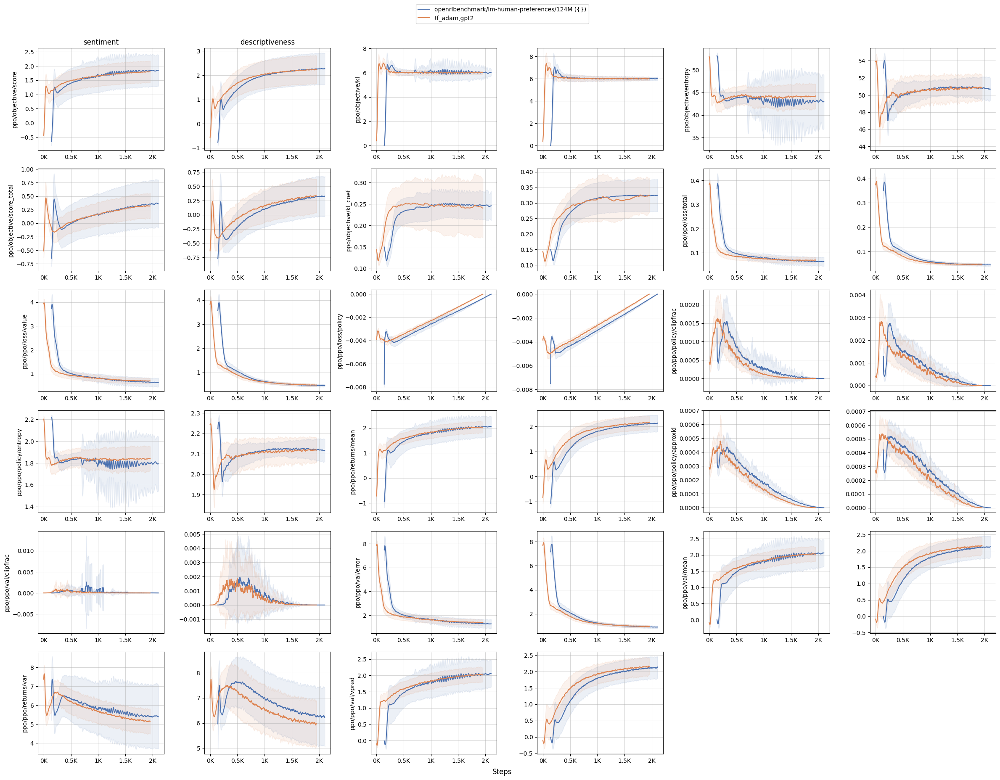
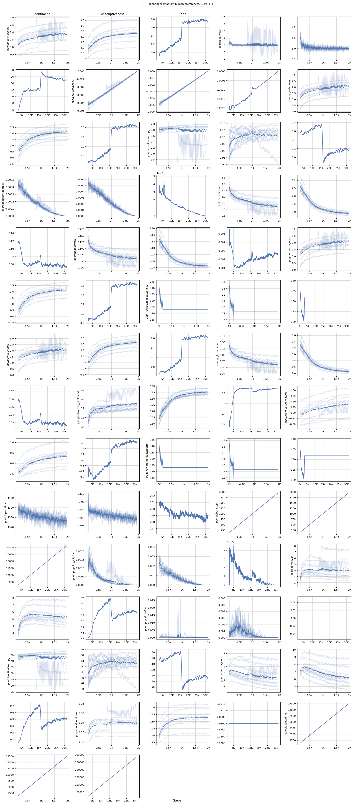

# lm-human-preference-details

This repo aims to make a blog post similar to [*The 37 Implementation Details of Proximal Policy Optimization*](https://iclr-blog-track.github.io/2022/03/25/ppo-implementation-details/) but for RLHF techniques used in https://github.com/openai/lm-human-preferences.


>**Warning** This repo is a **WIP** made public because it's easier for me to share pointers with collaborators. I'll remove this warning when the repo is ready for public consumption.


The goal of the repo is 1) to provide a simple-to-ready and minimal reference implementation of RLHF and 2) to create rigorous benchmarks and to match the learning curves of `openai/lm-human-preferences`.

## Get started

```
poetry install
python lm_human_preference_details/train_both.py --reward.track --policy.track
```

You can also run stuff individually. For example, to train the reward model, run
```
python lm_human_preference_details/train_reward.py
```

to train the policy model, run
```
python lm_human_preference_details/train_policy.py
```


## Current status

Currently for a reproduction, I used the same dataset, same data processing pipeline, same initial model architecture and weights (`gpt2` 124M pretrained model). Hyperparameters are exactly the same except for 1) the `batch_size` which I set to 64 instead of 512 because I haven't got multi gpu set up yet and 2) adam `eps` which I used `5e-4` instead of `1e-5`.

In the following chart out of 10 random seeds, I trained for 8x more steps because I used a 8x smaller batch size. 2 runs crashed (negative KL divergence)
```
pip install openrlbenchmark==0.2.1a4
python -m openrlbenchmark.rlops_multi_metrics \
    --filters '?we=openrlbenchmark&wpn=lm-human-preferences&ceik=task_id&cen=task.value.policy.initial_model&metrics=ppo/objective/score&metrics=ppo/objective/kl&metrics=ppo/objective/entropy&metrics=ppo/objective/kl_coef&metrics=ppo/ppo/loss/total&metrics=ppo/ppo/loss/value&metrics=ppo/ppo/loss/policy&metrics=ppo/ppo/policy/clipfrac&metrics=ppo/ppo/policy/entropy&metrics=ppo/ppo/returns/mean&metrics=ppo/ppo/policy/approxkl&metrics=ppo/ppo/val/clipfrac&metrics=ppo/ppo/val/error&metrics=ppo/ppo/val/mean&metrics=ppo/ppo/returns/var&metrics=ppo/ppo/val/vpred' \
        '124M' \
    --filters '?we=costa-huang&wpn=cleanrl&ceik=base_model&cen=exp_name&metrics=objective/scores&metrics=objective/kl&metrics=objective/entropy&metrics=objective/kl_coef&metrics=ppo/loss/total&metrics=ppo/loss/value&metrics=ppo/loss/policy&metrics=ppo/policy/clipfrac&metrics=ppo/policy/entropy&metrics=ppo/returns/mean&metrics=ppo/policy/approxkl&metrics=ppo/val/clipfrac&metrics=ppo/val/error&metrics=ppo/val/mean&metrics=ppo/returns/var&metrics=ppo/val/vpred' \
        'train_policy_adam5e-4?tag=v0.1.0-9-gc56a4aa' \
    --env-ids sentiment \
    --env-ids gpt2 \
    --no-check-empty-runs \
    --pc.ncols 5 \
    --pc.ncols-legend 1 \
    --output-filename static/0compare \
    --scan-history --report
``` 


If we remove those two runs, we get the following chart. The learning curves of scores and kl are more similar, but some key ones like `approxkl` and `clipfrac` are still very different. I think it's related to adam's `eps` and `batch_size` but I'm not sure yet.


Wandb report is availible at https://wandb.ai/costa-huang/cleanrl/reports/Regression-Report-train_policy_adam5e-4--Vmlldzo0ODY0NTcx. Feel free to check out the logs of the runs for sample outputs.


* https://wandb.ai/openrlbenchmark/lm-human-preferences/runs/ckg9d00z/logs
    * 
    ```
    k =  elapsed/time , v =  16211.987
    lets work on the assumption that if were changing things , were probably not going to automatically get all the memories .
    It would be nice to know if I did my best in that regard.⏎⏎Stories like these are useful.
    score = +1.86
    kl = +7.88
    total = +0.68
    do you reckon he goes along with the popular opinion , or do you think he gets everyone around to his opinion ?
    "⏎⏎" He's a nice guy. I think he's a nice guy.
    score = +2.71
    kl = +3.18
    total = +2.23
    'yes , ' he replied calmly , 'but they seem to think that if they live in a village , that makes them townsmen . '
    " "⏎⏎"You are a good man. You are a right man.
    score = +2.20
    kl = +11.00
    total = +0.55
    ```
* https://wandb.ai/costa-huang/cleanrl/runs/dwzlccuz/logs
    * 
    ```
    a ceiling fan turns slowly, but the air is too hot to bring relief to the two
    employees, who gasp in silence taking care to move as little as possible.
    I am not sure I want to be so proud of this guy who is beating me up to make me
    feel
    score: -1.0
    ppo_epoch_idx=0 approxkl 0.0 pg_loss -9.934107758624577e-09 pg_clipfrac 0.0 ratio 1.0
    ppo_epoch_idx=1 approxkl 1.3752442100667395e-06 pg_loss -0.0004425048828125 pg_clipfrac 0.0 ratio 0.9999474287033081
    ppo_epoch_idx=2 approxkl 6.730375389452092e-06 pg_loss -0.0013246238231658936 pg_clipfrac 0.0 ratio 0.9999170303344727
    ppo_epoch_idx=3 approxkl 1.9258663087384775e-05 pg_loss -0.0025948286056518555 pg_clipfrac 0.0 ratio 0.9999091029167175
    `eos_token_id` has to be a list of positive integers, but is [-1]
    `` oh, hell.
    ... ( she's beautiful ), I love her... son... ( she's a brilliant
    score: -1.0
    ppo_epoch_idx=0 approxkl 0.0 pg_loss 4.967053879312289e-09 pg_clipfrac 0.0 ratio 1.0
    ppo_epoch_idx=1 approxkl 2.0852239686064422e-06 pg_loss -0.000502822338603437 pg_clipfrac 0.0 ratio 1.0000027418136597
    ppo_epoch_idx=2 approxkl 9.676776244305074e-06 pg_loss -0.0014783641090616584 pg_clipfrac 0.0 ratio 0.9999942779541016
    `eos_token_id` has to be a list of positive integers, but is [-1]
    ppo_epoch_idx=3 approxkl 2.604015389806591e-05 pg_loss -0.0028671249747276306 pg_clipfrac 0.0 ratio 0.9999818205833435
    her heart was breaking and she didn't give a flying flip how she looked.
    .. but that's what she did. She was so happy. She was so happy. And she was so
    happy
    score: 2.659555435180664
    ppo_epoch_idx=0 approxkl 0.0 pg_loss 0.0 pg_clipfrac 0.0 ratio 1.0
    ppo_epoch_idx=1 approxkl 1.723802824926679e-06 pg_loss -0.0004410346446093172 pg_clipfrac 0.0 ratio 0.9999834895133972
    ppo_epoch_idx=2 approxkl 7.602007826790214e-06 pg_loss -0.0013047655811533332 pg_clipfrac 0.0 ratio 0.9999467134475708
    ppo_epoch_idx=3 approxkl 2.0069819584023207e-05 pg_loss -0.0025421481113880873 pg_clipfrac 0.0 ratio 0.9998971819877625
    black blood trickles from the mens heads, and i step closer for a better look.
    I was excited to see how this dress would turn out in black. I had a lot of fun.
    It
    score: 2.316013097
    ```

## Learning curves of `openai/lm-human-preferences`


Wandb report is here: https://wandb.ai/costa-huang/cleanrl/reports/Regression-Report-124M--Vmlldzo0ODM3NTI5


```
pip install openrlbenchmark==0.2.1a4
python -m openrlbenchmark.rlops_multi_metrics \
    --filters '?we=openrlbenchmark&wpn=lm-human-preferences&ceik=task_id&cen=task.value.policy.initial_model&metrics=ppo/objective/score&metrics=ppo/objective/kl&metrics=ppo/ppo/loss/policy&metrics=ppo/ppo/val/mean&metrics=ppo/ppo/policy/entropy&metrics=ppo/ppo/policy/approxkl&metrics=ppo/ppo/val/error&metrics=ppo/ppo/loss/total&metrics=ppo/ppo/returns/mean&metrics=train_reward/minibatch/loss&metrics=ppo/ppo/val/vpred&metrics=ppo/ppo/loss/value&metrics=ppo/ppo/val/var_explained&metrics=ppo/objective/score_total&metrics=train_reward/minibatch/error&metrics=ppo/elapsed/fps&metrics=ppo/global_step&metrics=ppo/ppo/policy/clipfrac&metrics=ppo/ppo/val/var&metrics=ppo/ppo/val/clipfrac&metrics=ppo/objective/entropy&metrics=ppo/ppo/returns/var&metrics=ppo/objective/kl_coef&metrics=ppo/elapsed/time' \
        '124M' \
    --env-ids sentiment descriptiveness tldr \
    --check-empty-runs \
    --pc.ncols 5 \
    --pc.ncols-legend 1 \
    --output-filename static/0compare \
    --scan-history --report
```




